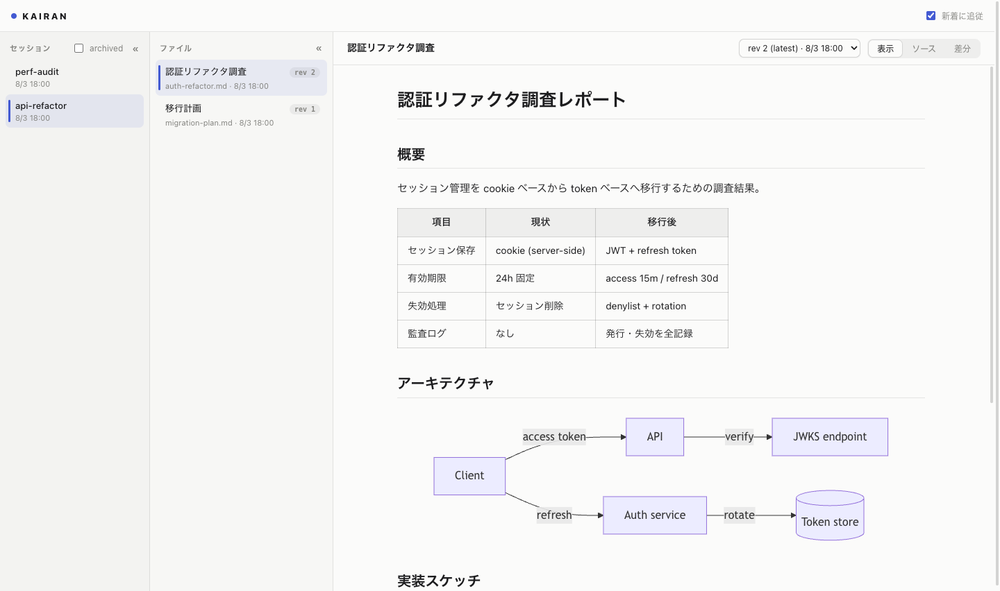
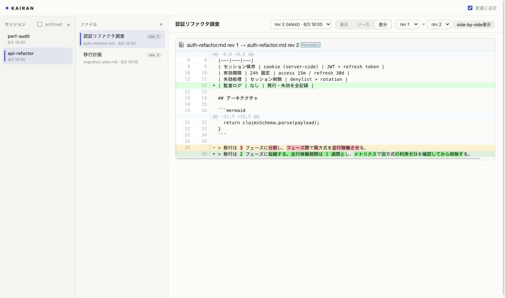
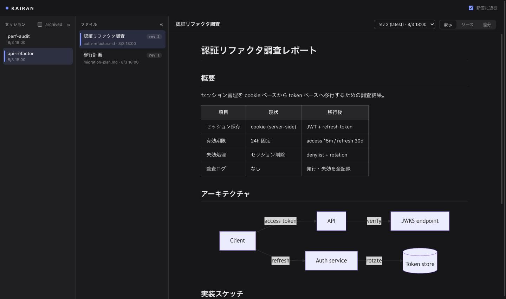

# KAIRAN

Claude Code / Codex などの agent が生成した markdown / HTML を、tool call ひとつでブラウザに表示するローカル MCP サーバー。



| リビジョン差分（unified / side-by-side） | ダークモード |
|---|---|
|  |  |

- 何個の agent から接続されても、表示サーバーは 1 つ・port は 1 つ（初回 tool call で自動起動、全員がいなくなると自動停止）
- セッションには**表示名**を付けられる（`start_session` で agent が付け、ブラウザからいつでも変更できる）。ID は日時ベース（`0814-1345`）で自動採番され、URL に出る
- サイドバーの各セッションから**改名・アーカイブ・完全削除**ができる。ファイルは表示中のツールバーから削除できる（どちらも元に戻せない）
- URL は `http://localhost:5766/<セッションID>/<ファイル名>`。全 URL が deep link
- 同じ名前で再 publish すると新リビジョンとして積まれ、リビジョン間の差分（unified / side-by-side）が見られる
- 3 ペイン UI（セッション / ファイル / ビュー）+ SSE live update。新着 publish への自動追従は「新着に追従」トグルで制御
- agent が終了したセッションは自動で archive され、サイドバーの「archived」トグルで表示できる。`kairan restart` を挟んでも、生きている agent のセッションは active のまま残る
- markdown は GFM + shiki シンタックスハイライト + mermaid 図に対応。HTML は iframe でそのまま実行できる。publish された文書のスクリプトは動くが、CSP により kairan 自身の API へは触れない（HTML は `sandbox` で opaque origin に、markdown 側は本体画面の `script-src 'self'` で inline handler を禁止）
- **タブの favicon がステータスを示す**。あなたの対応待ち（未回答の質問・agent がレビュー送信を待っている）があれば赤バッジ、タブを開いている間に届いた未読の publish があれば青バッジ。タブタイトルにも対応待ちの件数が出る
- **表示中のファイルを「Finder で表示」「エディタで開く」「ダウンロード」できる**。Finder / エディタは `path` で publish されたファイルを localhost から見ているときだけ出る（cloudflare tunnel 等のリモート閲覧ではダウンロードのみ）
- publish 時に macOS 通知センターへ通知（設定で off 可）。[terminal-notifier](https://github.com/julienXX/terminal-notifier) が入っていれば**通知クリックでそのファイルをブラウザで開ける**（`brew install terminal-notifier`。無ければ osascript 通知にフォールバック、クリック遷移なし）
- **人間 → agent のフィードバック**にも対応。文書にインラインコメントを付けて GitHub PR レビューのように一括送信でき（`request_review` で agent が受け取る）、agent からの選択肢つき質問（`ask_user`）にブラウザ上で回答できる

## セットアップ

```bash
bun install
bun link   # `kairan` コマンドをグローバルに登録
```

### Claude Code

```bash
claude mcp add --scope user kairan -- kairan mcp
```

### Codex CLI

```toml
# ~/.codex/config.toml
[mcp_servers.kairan]
command = "kairan"
args = ["mcp"]
```

## tool

### `start_session`

このプロセスのセッションを開始し、人間向けの表示名を付ける。最初の `publish` の前に一度呼ぶと、サイドバーでどの agent のセッションか見分けられる。以後 `session` を省略した tool call はここで始めたセッションに載る。

| 引数 | 説明 |
|---|---|
| `label` | サイドバーに出る表示名。**一意である必要はなく**、ブラウザからいつでも変更できる |
| `id` | セッション ID（URL セグメント）を固定したいときだけ渡す。省略時は日時ベース（`0814-1345`）で自動採番 |

戻り値: `{ sessionId, label, url }`

### `publish`

markdown / HTML をブラウザに表示する。`path`（ファイルパス）か `content`（文字列）のどちらかを渡す。

| 引数 | 説明 |
|---|---|
| `path` | 表示するファイルのパス（`content` と排他） |
| `content` | 本文の直接渡し（`name` 必須） |
| `name` | セッション内のファイル ID（URL セグメント）。省略時は `path` の basename。**同名で再 publish = 上書き = 新リビジョン** |
| `format` | `markdown` / `html`。省略時は拡張子から推定 |
| `session` | publish 先のセッション ID（別プロセスから同じセッションを継続するときに使う）。省略時はこのプロセスのセッション |
| `title` | ファイルリストに表示するタイトル |
| `open` | `true` で強制オープン / `false` でオープン抑制 |

戻り値: `{ url, sessionId, fileId, revision, pendingFeedback }`（`pendingFeedback` は未受領フィードバック件数）

`path` で publish したファイルは元の絶対パスが記録され、ブラウザの「Finder で表示」「エディタで開く」から開ける（`content` で publish し直すと記録は消える）。パス自体は API の応答にも `list_files` にも出ない。

### `list_files`

自セッション（または `session` で指定したセッション ID）の publish 済みファイル一覧。

### `request_review`

人間にブラウザでのレビューを依頼し、**送信されるまでブロックする**。人間側はコメントを下書きとして溜め、総評とともに「送信」した時点でまとめて返る（GitHub PR レビューと同じモデル。コメント 0 件 + 総評空の「コメントなしで返す」も可）。timeout（デフォルト 20 分、`timeout_seconds` で変更可）で「まだフィードバックなし」が返るので、続けて待つ場合は再度呼ぶ（再呼び出しループで何時間でも待てる）。

戻り値には各コメントの `commentId`・対象ファイル・引用文（選択範囲）・本文と、総評・スレッド返信・未回収の質問回答が含まれる。

### `ask_user`

選択肢つきの質問カードをブラウザに表示し、**回答されるまでブロックする**。複数 question を 1 カードに積め、各 question は選択肢 + 自由記述（常設）を持つ。人間は全問に答えてから送信する。`file` を渡すとその質問がどのファイルの話かサイドバーにバッジ表示される。timeout 後に同じ質問で再度呼ぶと**既存カードを再利用して待ち直す**（カードは増えない）。

### `reply_comment`

`request_review` / `list_feedback` が返した `commentId` へのスレッド返信。`resolve: true` でコメントを解決済みにできる（人間側から再オープン可）。

### `list_feedback`

ブロックせずに、送信済み・未受領のフィードバック（レビュー・質問回答）を回収する。agent が待っていない間に送信されたぶんの回収用。各項目は一度だけ返る。

## CLI

```bash
kairan status    # デーモンの稼働確認
kairan restart   # デーモンの再起動（コード・設定変更の反映用）
kairan stop      # デーモンの停止（通常は不要: 全接続が消えると自動停止する）
kairan daemon    # デーモンをフォアグラウンド起動（通常は自動起動されるため不要）
```

### コード変更の反映

- **デーモン側**（Web UI・API・レンダリング・通知など大半のロジック）: `kairan restart` で反映される。稼働中の agent は自動で接続し直すため、セッションは active のまま残る
- **stdio ランチャー側**（tool 定義・入力解決）: ランチャープロセスは agent が起動・保持しているため kairan 側からは再起動できない。agent の MCP 再接続で反映される（Claude Code は `/mcp` → Reconnect、または新しいセッションを開始）

## 設定

`~/.kairan/config.json`（すべて任意）と環境変数で上書きできる。優先度: 環境変数 > config.json > デフォルト。

| キー | 環境変数 | デフォルト | 説明 |
|---|---|---|---|
| `port` | `KAIRAN_PORT` | `5766` | デーモンの listen port |
| `host` | `KAIRAN_HOST` | `127.0.0.1` | bind アドレス（`127.0.0.1` / `localhost` / `::1` のみ。認証なしのため loopback 限定） |
| `dataDir` | `KAIRAN_DATA_DIR` | `~/.kairan` | SQLite / lock の置き場所 |
| `autoOpen` | `KAIRAN_AUTO_OPEN` | `session-first` | `session-first`（セッション初回のみ自動オープン）/ `always` / `never` |
| `reopenWhenNoTab` | `KAIRAN_REOPEN_WHEN_NO_TAB` | `true` | publish 時にそのセッションを見ているタブが無ければ開き直す |
| `notifications` | `KAIRAN_NOTIFICATIONS` | `true` | macOS 通知センターへの通知 |
| `notifyOn` | `KAIRAN_NOTIFY_ON` | `all` | `all`（上書きも通知）/ `new-file`（新規ファイルのみ） |
| `openCommand` | `KAIRAN_OPEN_COMMAND` | `open` | ブラウザを開くコマンド |
| `editorUrl` | `KAIRAN_EDITOR_URL` | `vscode://file{path}` | 「エディタで開く」の URL テンプレート。`{path}` が publish 元の絶対パスに置換される（Cursor なら `cursor://file{path}`）。空文字にするとボタンを出さない |
| `followDefault` | `KAIRAN_FOLLOW_DEFAULT` | `true` | UI「新着に追従」トグルの初期値 |
| `reuseTab` | `KAIRAN_REUSE_TAB` | `true` | 自動オープン・通知クリック時に既存の kairan タブを再利用する（Chrome 系 / Safari。初回に macOS の自動化許可が必要。`false` で常に新規タブ） |
| `shutdownGraceMs` | `KAIRAN_SHUTDOWN_GRACE_MS` | `5000` | 全接続 0 になってから自動停止するまでの猶予 |
| `archiveGraceMs` | `KAIRAN_ARCHIVE_GRACE_MS` | `10000` | デーモン起動後、生きている agent が接続し直すのを待つ時間。これを過ぎても接続の無い active セッションは archive する |
| `feedbackWaitMs` | `KAIRAN_FEEDBACK_WAIT_MS` | `1200000`（20 分） | `request_review` / `ask_user` の 1 回の待機時間。timeout 後は agent が再呼び出しで待ち直す |

設定ファイルのパス自体は `KAIRAN_CONFIG_PATH` で変更できる。

## 公開する場合の注意

kairan 自体は**認証を持たない**。`/api/*` の POST に入っているのは cross-origin を弾く CSRF 対策であって認証ではなく、Origin ヘッダの無いリクエスト（MCP ランチャー・curl）は意図的に通す。cloudflare tunnel 等で外から届くようにする場合、**tunnel 側で認証をかけること**（到達できる相手はセッションの一覧取得も完全削除もできる）。

## アーキテクチャ

```
agent (Claude Code / Codex)
  │ stdio MCP
  ▼
kairan mcp（agent ごとに 1 プロセス。port は使わない）
  │ HTTP（初回 tool call 時にデーモンを自動 spawn・生存申告の SSE を維持）
  ▼
kairan daemon（全体で 1 つ・port 1 つ）── SQLite (~/.kairan/kairan.db)
  │ HTTP + SSE
  ▼
browser（3ペイン UI）
```

- stdio プロセス = 1 セッション。プロセス終了（= agent 終了）で TCP が切れ、デーモンがセッションを archive する
- デーモンは「active セッション 0 かつ 閲覧タブ 0」になると自動停止する。データは SQLite に永続化されているため、次回起動時も過去セッションを閲覧できる
- 設計判断の経緯: `.local/docs/adr/0001-stdio-launcher-shared-daemon.md`

## 開発

```bash
bun test            # テスト
bun run typecheck   # tsc
bun run lint        # biome
bun run dev         # デーモンをフォアグラウンド起動
```
